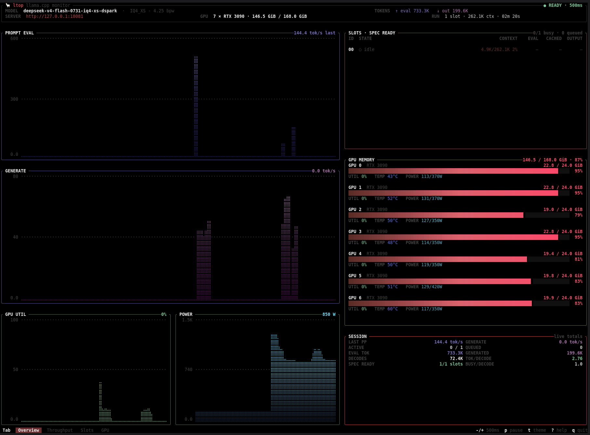

# 🦙 ltop

**A btop-inspired terminal monitor for llama.cpp servers.**

ltop combines llama.cpp request telemetry with host and process statistics in a responsive terminal UI. It shows prompt-evaluation and generation throughput, slot activity, context and cache use, GPU memory, utilization, temperature, power, server-process totals, and a detailed description of what the service is actually running without requiring a browser.

The interface uses one configurable polling cadence, supports btop-compatible themes, and adapts from a complete dashboard to focused section views on smaller terminals.

## Screenshots



*The ltop dashboard monitoring a llama.cpp server.*


## Highlights

- Server-timed prompt-evaluation throughput and live generation throughput
- Prefill/decode/idle slot lanes with context, evaluated input, cache reuse, and output
- A focused cache view with prompt-reuse composition, context headroom, observed-request totals, and runtime cache configuration
- A dedicated service view with model scale, trained context, runtime configuration, capabilities, process uptime, host pressure, source health, and active-request details
- Multi-GPU memory meters plus utilization, temperature, and power telemetry
- High-resolution Braille history charts inspired by btop
- One polling interval for `/metrics`, `/slots`, `/props`, `/v1/models`, and local host telemetry
- Responsive full-dashboard and focused-section layouts
- Bundled palettes, btop `.theme` compatibility, and live theme previews
- Automatic local llama.cpp server discovery or an explicit remote URL

## Requirements

- A current stable Rust toolchain to build ltop
- A running `llama-server` with the metrics and slots endpoints enabled
- A terminal at least `60×20`; Unicode and true-color support are recommended
- `nvidia-smi` for NVIDIA GPU telemetry when monitoring a local server; ltop remains usable without it

For example, start llama.cpp with the endpoints ltop consumes:

```bash
llama-server \
  --model /path/to/model.gguf \
  --host 127.0.0.1 \
  --port 8080 \
  --metrics \
  --slots
```

The exact llama.cpp arguments available to you depend on your server build.

## Installation

From a repository checkout, install the `ltop` binary into Cargo's binary directory:

```bash
cargo install --path . --bin ltop
```

Alternatively, build and run it directly:

```bash
cargo build --release
./target/release/ltop
```

The included helper performs the same release build:

```bash
./install.sh
./target/release/ltop
```

## Getting started

When no URL is supplied, ltop looks for a local `llama-server` process and then checks common localhost ports:

```bash
ltop
```

Pass a URL to monitor a specific local or remote server:

```bash
ltop http://127.0.0.1:8080
ltop http://inference-host:8080
```

Options can appear before or after the URL. This example selects a theme and polls every second:

```bash
ltop --theme "Tokyo Night" --update 1000 http://127.0.0.1:8080
```

Run `ltop --help` for the built-in command reference.

## Dashboard

On roomy terminals, ltop presents the operational charts together. Selecting `Service` or `Cache` opens its detailed view at any terminal size; on smaller terminals, `Tab` and `Shift-Tab` also switch the other panels into focused views.

| Panel | What it shows |
|---|---|
| `PROMPT EVAL` | The latest completed prompt-evaluation speed and its polling timeline |
| `GENERATE` | Current decoded-token throughput derived from active slots |
| `SLOTS` | Lane state, retained context, evaluated and reused input, and output |
| `CACHE` | Current or last-observed prompt reuse, context headroom, weighted observed-window totals, per-slot reuse, and cache configuration |
| `GPU MEMORY` | Aggregate and per-device VRAM usage with adaptive device details |
| `GPU UTIL` | Average GPU utilization history |
| `POWER` | Total GPU power history |
| `SERVER METRICS` | Explicitly labeled live rates, a compact current-or-last prompt-reuse and context-headroom summary, and process-lifetime token, generation-average, and decode statistics |
| `SERVICE` | Model size and capabilities, active/trained context, launch configuration, server uptime, host/cgroup memory, source health, queue limitations, and current request parameters |

The GPU memory view prioritizes capacity: each device receives an aligned usage value, percentage, and compact dot meter. Normal usage keeps the theme's memory color, while 90–95% uses the warning color and values above 95% use the critical color. Utilization, temperature, power, and model identity remain secondary information, and a range marker such as `3–6/8` appears when the device list is clipped.

## Keyboard controls

| Key | Action |
|---|---|
| `q` / `Ctrl-C` | Quit |
| `Tab` / `Shift-Tab` | Select the next or previous section |
| `c` | Open the cache section directly |
| `↑` / `↓` | Scroll service, cache, slot, and GPU details |
| `p` | Pause or resume collection |
| `-` / `+` | Decrease or increase polling by 100 ms |
| `t` | Open the live theme picker |
| `?` / `h` | Open or close help |
| `Esc` | Close help or cancel the theme picker |

Inside the theme picker:

| Key | Action |
|---|---|
| `↑` / `↓` or `k` / `j` | Preview the previous or next theme |
| `Page Up` / `Page Down` | Move five themes at a time |
| `Home` / `End` | Jump to the first or last theme |
| `b` | Toggle the theme background |
| `Enter` | Apply and save the previewed theme |
| `Esc`, `q`, or `t` | Cancel and restore the applied theme |

## Command-line reference

```text
Usage: ltop [OPTIONS] [URL]
```

| Option | Description |
|---|---|
| `[URL]` | llama.cpp server URL; auto-detected when omitted |
| `-u, --update <MS>` | Universal polling interval in milliseconds |
| `--theme <NAME or PATH>` | Discovered theme name or path to a btop `.theme` file |
| `--themes-dir <DIR>` | Search an additional theme directory first |
| `--list-themes` | Print discovered themes and exit |
| `--transparent` | Preserve the terminal's background color |
| `-h, --help` | Print help and exit |
| `-V, --version` | Print the version and exit |

The update interval accepts integer values from `100` through `86400000` ms. Its default is `2000` ms, matching btop's `update_ms` model.

## Polling and configuration

`/metrics`, `/slots`, `/props`, `/v1/models`, and applicable local host sources are collected as one snapshot on one deadline. There are no component-specific timers. When collection takes longer than the configured interval, ltop skips missed ticks instead of issuing a burst of catch-up requests.

Changes made with `-` and `+`, along with the applied theme and background preference, are saved to:

```text
$XDG_CONFIG_HOME/ltop/config
```

If `XDG_CONFIG_HOME` is unset, ltop uses `~/.config/ltop/config`.

```ini
# ltop preferences
theme = "ltop"
theme_background = true
update_ms = 2000
```

Pausing stops collection. Resuming starts with a fresh snapshot so time spent paused is not misreported as throughput.

## Themes

Press `t` for live previews. ltop includes these palettes:

- ltop
- Default
- TTY
- Tokyo Night
- Gruvbox Dark
- Nord
- Dracula
- Solarized Light

ltop understands btop `.theme` files and discovers them from:

- A directory passed with `--themes-dir`
- `$XDG_CONFIG_HOME/ltop/themes` or `~/.config/ltop/themes`
- Installed ltop theme directories under `/usr/local/share` and `/usr/share`
- `$XDG_CONFIG_HOME/btop/themes` or `~/.config/btop/themes`
- Installed btop theme directories under `/usr/local/share` and `/usr/share`

Theme names are case-insensitive, and spaces, underscores, and hyphens are interchangeable.

```bash
# List every discoverable theme
ltop --list-themes

# Select a discovered theme
ltop --theme Nord

# Load a theme file directly
ltop --theme ~/.config/btop/themes/onedark.theme

# Search a custom directory first
ltop --themes-dir ./themes --theme custom

# Select through the environment
LTOP_THEME="Gruvbox Dark" ltop
```

See [themes/README.md](themes/README.md) for notes about the bundled files and custom theme syntax.

## Data sources and metric semantics

| Source | Used for |
|---|---|
| `/metrics` | Prompt-processing counters and timing, request pressure, token totals, and decode statistics |
| `/slots` | Per-lane phase and task, context use, evaluated and reused input, output limits/progress, request mode, sampling, and speculative capability |
| `/props` | Model identity, quantization, build information, defaults, endpoints, modalities, tool capabilities, slot count, and active context size |
| `/v1/models` | Parameter count, model size, architecture metadata, and trained context size |
| `/proc` and cgroup v2 (local servers) | Server PID and uptime, launch configuration, process/cgroup memory, host memory, swap, CPU count, and load |
| `nvidia-smi` (local servers) | GPU utilization, memory, temperature, power, clocks, and fans |

### Service and workload scope

Press `Tab` to select `Service`. This view separates values with different scopes instead of presenting them as one ambiguous session:

- `LIFETIME` values and cumulative values inside `SERVER METRICS` are llama.cpp process counters; live rates are labeled separately.
- Header uptime is the real server-process uptime when ltop can match a local `llama-server`; otherwise it is explicitly labeled as the current view's uptime.
- Generation shows both the live slot-derived rate and llama.cpp's process-lifetime average.
- `SPEC ENABLED` describes configuration only. Draft acceptance is reported as unavailable because the endpoints ltop polls do not expose it; ltop does not substitute tokens-per-decode as a misleading acceptance proxy.
- When requests are queued, ltop reports that their age and client identity are not exposed by llama.cpp telemetry.
- Source failures are shown individually, including when cached model or property data has become stale.

Local process and host facts are intentionally omitted for remote URLs because they would describe the machine running ltop, not the inference server. For the same reason, ltop does not show local `nvidia-smi` data while monitoring a remote URL.

### Prompt evaluation

`PROMPT EVAL` is based on llama.cpp's cumulative evaluated-token and active prompt-processing-time counters rather than HTTP scrape time:

- `last` is the token-counter delta divided by the prompt-time delta between two snapshots.
- `avg` is llama.cpp's cumulative average gauge, used on the initial connection or when millisecond counter rounding prevents a safe interval calculation.
- The headline retains the most recent valid measurement.
- The chart advances on every polling tick and records zero when no new prompt work completes.
- `EVAL TOK` excludes prompt tokens reused from cache.

This makes gaps between prefill bursts visible without allowing idle time or request latency to distort the measured speed.

### Cache and prompt reuse

Press `c` to open `CACHE`. The view deliberately separates three related concepts:

- `REUSE` is the share of prompt input llama.cpp reports as already cached: `reused / (reused + evaluated)`. The bar and exact counts use distinct symbols as well as colors.
- `CONTEXT` is token occupancy and headroom for the active slot. It is not presented as KV-cache byte usage.
- `CACHE CONFIGURATION` reports KV key/value types and the configured RAM-cache budget when ltop can inspect a matching local server process.

`OVERVIEW` keeps the same signal within easy reach as `REUSE NOW` (or `REUSE LAST` while idle) and `CTX FREE`; press `c` for the full request, per-slot, observed-window, and configuration breakdown.

Reuse is provisional during prefill and settles when decoding begins. Low reuse is normal for a new or unrelated prompt, so it is not treated as an error. When the server becomes idle, ltop retains the last request it observed and maintains a token-weighted `OBSERVED SINCE LTOP START` summary without double-counting repeated polls of the same task.

Observed totals include active and completed tasks seen through `/slots`; short requests that start and finish between polls can be missed. This llama.cpp build does not expose actual KV-cache bytes, entry or eviction counts, process-lifetime reuse totals, or exact time saved, so ltop labels those limits instead of inferring them.

### Slots and generation

Generation throughput uses changes in each active slot's decoded-token counter. ltop tracks lanes independently so a request transition or counter reset in one slot cannot erase progress from another. The service view also retains llama.cpp's lifetime generation average so a momentary rate has the necessary context.

Slot `REUSE` percentages are provisional while prompt evaluation is still running and settle when that phase completes. Values belonging to a previous task are not shown as current output on an idle lane.

## Troubleshooting

### The server is not detected

Pass its URL explicitly:

```bash
ltop http://host:port
```

Auto-detection is designed primarily for local Linux processes. An explicit URL is the most reliable choice for containers, remote servers, and other operating systems.

### Metrics or slots are unavailable

Confirm that your `llama-server` exposes `/metrics`, `/slots`, and `/props`, and that it was started with the corresponding metrics and slots options. ltop reports endpoint failures in the status and slot views instead of silently presenting an empty server.

### GPU telemetry is unavailable

For a local server, verify that `nvidia-smi` is installed, available in `PATH`, and can see the GPUs from the same environment where ltop runs. GPU telemetry is intentionally unavailable for remote URLs because local `nvidia-smi` output would describe the monitor machine, not the server. Server monitoring continues without GPU data.

### The interface is clipped or glyphs look wrong

Use a terminal of at least `60×20` and a font with Braille and emoji glyphs. Resize the terminal for the full dashboard or use `Tab` to navigate focused sections.

## Development

Run the complete local validation suite with:

```bash
cargo fmt --all -- --check
cargo test --all-targets
cargo clippy --all-targets -- -D warnings
```
